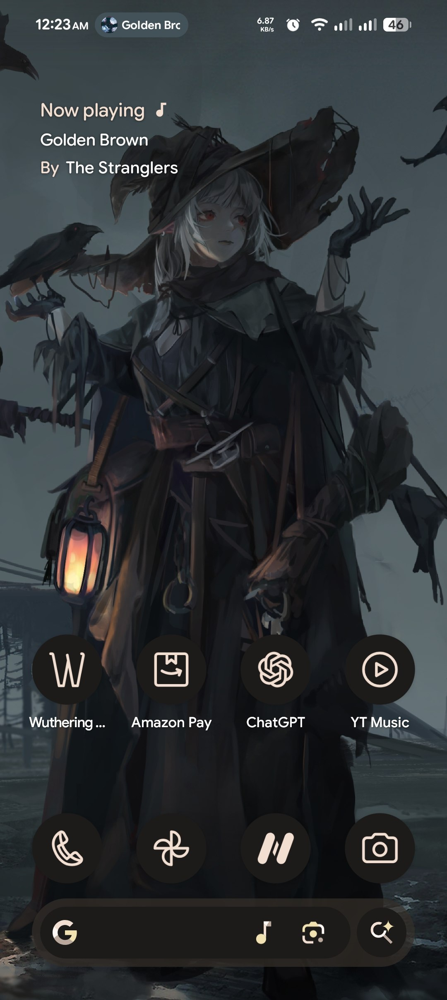
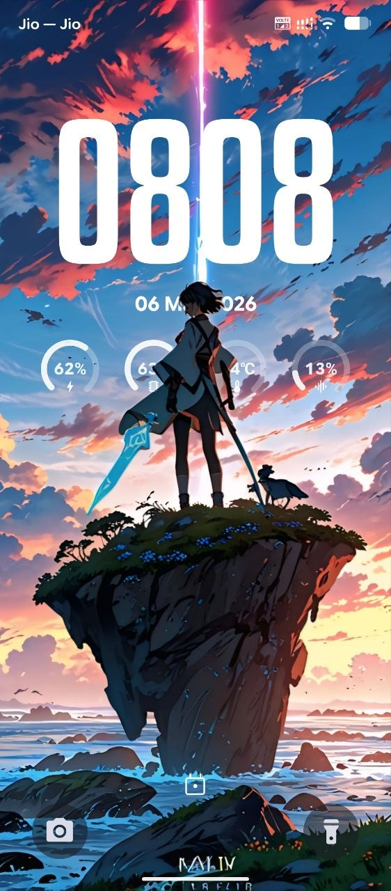
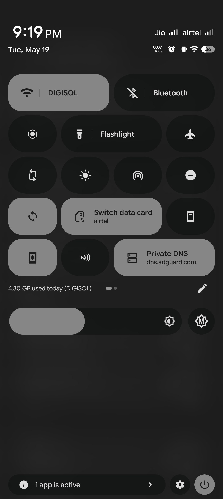
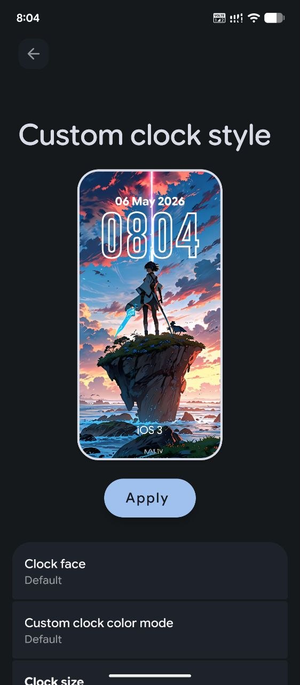
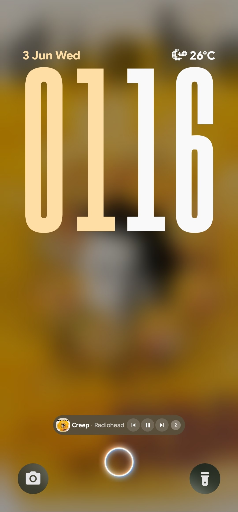

  

  

<h1 align="center">🌙 Lunaris AOSP</h1>

A beautiful, smooth and feature-rich Android 16 ROM for Redmi K50i / POCO X4 GT (xaga)

Built with ❤️ for users who love customization, performance and stability.

---

# ✨ Why Lunaris?

Lunaris AOSP is designed to deliver the perfect balance between **performance**, **battery life**, **smoothness**, and **deep customization** while maintaining the clean Android experience.

Whether you're a gamer, power user or someone who just wants a beautiful ROM, Lunaris has something for everyone.

---

# 🚀 Features

## 🎨 Personalization

- 50+ Beautiful Clock Styles
- Advanced Monet Engine
- Dynamic Bar
- Edge Lighting
- Depth Wallpapers
- LockScreen Customization
- Notification Customization
- QS Panel Customization
- Status Bar Tweaks
- Battery Styles
- Adaptive Icon Shapes
- Font Customization
- Live Wallpapers
- Material You Enhancements

---

## ⚡ Performance

- Optimized Rendering Pipeline
- Better Memory Management
- Faster Launcher Animations
- Smooth Scrolling
- Better Thermal Performance
- Reduced CPU Usage
- Better Battery Backup
- Optimized Gaming Experience
- Improved Background Process Handling

---

## 🌙 Lunaris Exclusive Features

- Dynamic Bar
- Split Quick Settings
- Advanced Clock Engine
- Idle Manager
- SmartPixel
- GameSpace
- Partial Screenshot
- Brief AOD Timer
- Back Peek AOD
- Torch Intensity Control
- Adaptive Gesture Controls
- Notification Badge Counter
- Dolby Atmos
- Advanced Monet Customization
- Live Wallpaper Support

---

## 🔒 Security

- Android 16
- July Security Patch
- TrickyStore Support
- Sandbox Support
- Better App Compatibility
- Improved System Integrity

---

# 📱 Device Information

| Information | Details |
|-------------|---------|
| Device | Redmi K50i / POCO X4 GT |
| Codename | xaga |
| Android Version | 16 |
| ROM Version | Lunaris v3.12 |
| Maintainer | Rohan |
| Build Type | GMS |

---

# 📸 Screenshots

  
  
  

  
  

---
# 📥 Installation

### Requirements

- Unlocked Bootloader
- Windows PC
- USB Cable
- Latest Platform Drivers

---

### Installation Steps

1. **Extract** the **Lunaris v3.12 ZIP** to a folder on your PC.
2. **Boot** your **Redmi K50i / POCO X4 GT** into **Fastboot Mode**.
3. **Connect** your device to the PC using a USB cable.
4. Open the extracted folder and **double-click** `Install_Lunaris.bat`.
5. When prompted, type **`1`** and press **Enter** to start the installer.
6. Choose whether to **Format Data**:
   - **Y** = Wipe Data *(Recommended for a clean installation)*
   - **N** = Keep existing data *(Not recommended when coming from another ROM)*
7. Choose your **Root** option:
   - **1** = Flash without Root
   - **2** = Flash with Root (Magisk)
8. Sit back and relax! The installer will automatically:
   - Flash all required partitions
   - Install Lunaris AOSP
   - Reboot your device when finished

> [!IMPORTANT]
> **Do not disconnect the USB cable or power off your device during the installation process.**

> [!TIP]
> A **clean flash (Format Data = Y)** is highly recommended when installing Lunaris for the first time or upgrading from a different ROM.

---

### First Boot

- The first boot may take **2–5 minutes**.
- Complete the Android setup wizard.
- Enjoy **Lunaris AOSP v3.12** 🚀

# 📜 Changelog

See the complete changelog here.

➡️ **[CHANGELOG.md](CHANGELOG.md)**

---

# ❤️ Credits

Special thanks to

- Google (AOSP)
- LineageOS
- Evolution X
- PixelOS
- RisingOS
- Project Matrixx
- SuperiorOS
- DerpFest
- The Android Open Source Community

---

# 👨‍💻 Maintainer

  

<h3 align="center">Rohan</h3>

Maintainer of Lunaris AOSP for Redmi K50i / POCO X4 GT (xaga)

---

# ⭐ Support

If you enjoy using **Lunaris AOSP**, consider giving this repository a ⭐.

It helps support the project and motivates future development.

---

### 🌙 Lunaris AOSP v3.12

**Pure AOSP • Deep Customization • Smooth Performance • Built with ❤️**

