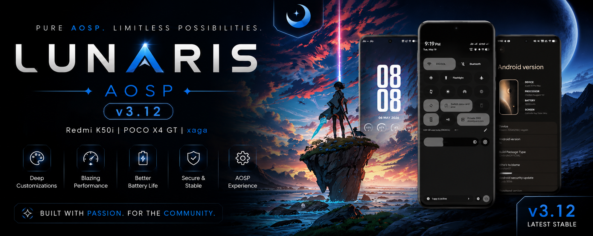

  

<h1 align="center">🌙 Lunaris AOSP</h1>

  <strong>Android 16 • Redmi K50i / POCO X4 GT (xaga)</strong>

  A clean, smooth and feature-rich Android experience focused on performance, battery life and customization.

  
  
  
  

---
